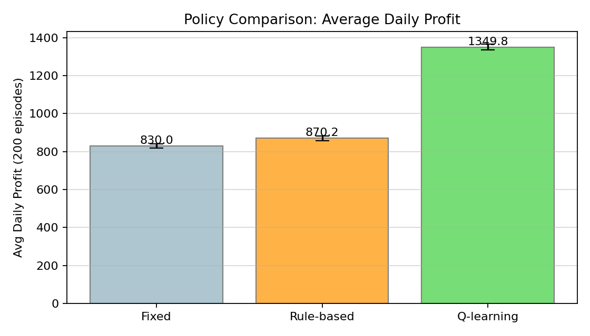

# RL-based Dynamic Pricing and Bundle Promotion Optimization

A tabular Q-learning agent that coordinates pricing, discounting, bundling, and price-discipline choices over a 120-day selling horizon. Beats a fixed-price baseline by **+62.6%** on average daily profit.

**Course:** BU.520.750 · AI-Driven Sequential Decision Making · Spring 2, 2026 · Carey Business School, Johns Hopkins University

**Group 8:** Astras Gao · Lihong Gao · Jinfeng Chen · Maoyuan Li

📄 **Final report (PDF):** [Group8_Final_Report.pdf](Group8_Final_Report.pdf)

---

## Overview

We model a daily retail pricing decision as a finite, discrete Markov Decision Process and solve it with off-policy tabular Q-learning. The agent observes a 72-state discrete tuple and selects from a 40-action joint set covering four pricing levers: price adjustment, bundle, discount, and a price-discipline mode (hysteresis or lock). The reward is dimensionless: profit normalised by a fixed reference, plus a tiered bonus when profit crosses thresholds, minus a small penalty when the price actually changes.

After 1,500 training episodes in a custom 120-day retail simulator, the learned policy reaches an average daily profit of **1,349.8 ± 15.2**, versus 830.0 for the fixed-price baseline (+62.6%) and 870.2 for a rule-based heuristic (+480/day). The result is stable across three demand-elasticity regimes, and an ablation shows the bundle action is roughly revenue-neutral on the symmetric cost calibration we use.

## Headline results

| Policy | Avg daily profit | Bundle | Discount | Price-chg | Locked |
|---|---:|---:|---:|---:|---:|
| Fixed | 830.0 ± 10.3 | 0% | 0% | 0% | 0% |
| Rule-based | 870.2 ± 12.1 | 28% | 0% | 0% | 0% |
| **Q-learning** | **1,349.8 ± 15.2** | 37% | 7% | 12.5% | 86% |

200 evaluation episodes per policy. Q-learning uses ε = 0 (greedy) at eval time.



## MDP design

**State** (5-dim, 72 configs): `inventory_bucket` × `demand_trend_bucket` × `season_bucket` × `bundle_prev_flag` × `price_locked_flag`.

**Action** (4-dim, 40 actions): `price_adj` ∈ {−10%, −5%, 0%, +5%, +10%} · `bundle` ∈ {0, 1} · `discount` ∈ {0%, 10%} · `discipline` ∈ {hysteresis, lock}.

- **Hysteresis** applies a price change only after 3 consecutive same-direction signals.
- **Lock** applies the change immediately and freezes the new price for the next 7 decision steps.

**Reward:** `r = π / π_ref + b(π / π_ref) − λ · 𝟙[price actually changed]`, where `π_ref = 900`, `λ = 0.05`, and `b(·)` is a five-tier ladder over normalised profit.

## Hyperparameters

| Symbol | Value | Notes |
|---|---:|---|
| α | 0.08 | Picked from a small sweep over {0.05, 0.08, 0.15, 0.30} |
| γ | 0.95 | Effective horizon ≈ 20 days |
| ε | 1.00 → 0.05 | Decay 0.995 per episode; floor at 0.05 |
| Horizon | 120 days | One simulated quarter |
| Episodes | 1,500 | Raised from 600 once discipline dynamics changed |
| Q-table | 72 × 40 = 2,880 | ≈ 22 KB in memory |

## File structure

```
RL-DynamicPricing-BundlePromotion/
├── rl_dynamic_pricing_bundle.ipynb   # main notebook (env + agent + experiments)
├── Group8_Final_Report.pdf           # final report (3-page body + appendix A/B/C)
├── scripts/
│   ├── run_experiments.py               # stand-alone reproducer (no notebook)
│   ├── diagnose_dip.py                  # training-curve dip diagnostic (Appendix C)
│   └── metrics.json                     # numeric summaries from a full run
├── figures/
│   ├── fig_training_curve.png
│   ├── fig_policy_comparison.png
│   ├── fig_discipline.png
│   ├── fig_robustness.png
│   ├── fig_ablation.png
│   ├── fig_trajectory.png
│   └── fig_dip_diagnostic.png
├── requirements.txt
└── README.md
```

## How to reproduce

```bash
# Python 3.10+ recommended
pip install -r requirements.txt

# Option A — run the notebook end to end
jupyter notebook rl_dynamic_pricing_bundle.ipynb

# Option B — run the stand-alone script (faster, regenerates all figures)
python scripts/run_experiments.py

# Option C — reproduce the training-curve dip diagnostic (Appendix C)
python scripts/diagnose_dip.py
```

Seed is fixed (`np.random.seed(42)`, `random.seed(42)`). A full run trains ~1,500 episodes in under a minute on a laptop CPU. The Q-table itself is about 22 KB.

## Note on the training-curve dips

The smoothed training-reward curve shows two transient dips, around episode 550 and 1,260. These are mid-training policy-oscillation events at the ε floor, a known phenomenon under stochastic rewards. They self-correct within ~90 episodes and have no effect on the final greedy evaluation. The per-episode signature (downward price changes doubling from 2.3 to 5.3 per episode, ε at 0.05 floor, locked-state ratio dropping slightly) and a full mechanism breakdown are in Appendix C of the final report. See `scripts/diagnose_dip.py` and `figures/fig_dip_diagnostic.png`.

## Deliverables

- **Final Report** (3-page body + appendix A/B/C): [`Group8_Final_Report.pdf`](Group8_Final_Report.pdf) in this repo; also submitted on Canvas.
- **Presentation slides** (11 slides, 7-min slot): PPTX on Canvas, delivered on May 5, 2026.
- **Code:** this repository.

## Acknowledgement

This project draws on Sutton & Barto, *Reinforcement Learning: An Introduction* (MIT Press, 2nd ed., 2018), and on lecture notes for BU.520.750 by Prof. Ali Eshragh.

GenAI tools (Claude, ChatGPT) were used to draft and refine written deliverables (the proposal, the report, the slides, and this README) and to help structure exploratory scripts. The MDP design, the experimental decisions, the code, the training runs, and all numerical results are the authors' own, and were independently re-executed before submission.

## License

Released for course evaluation. If you'd like to reuse any part of this work, please open an issue first.
